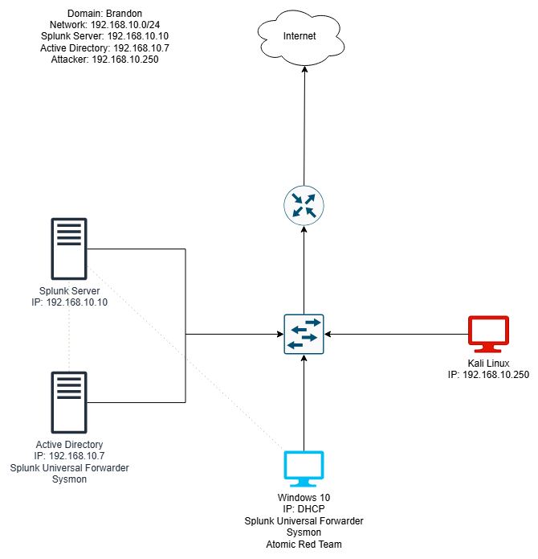
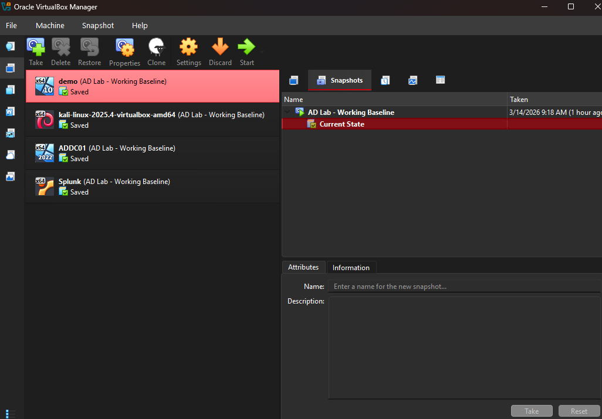
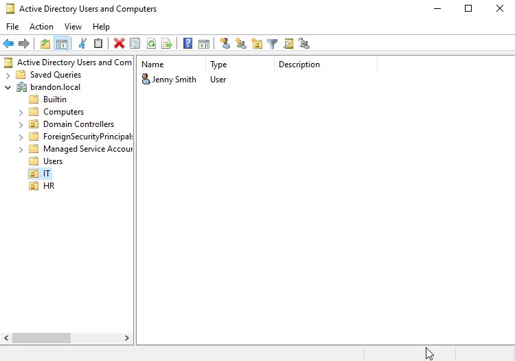
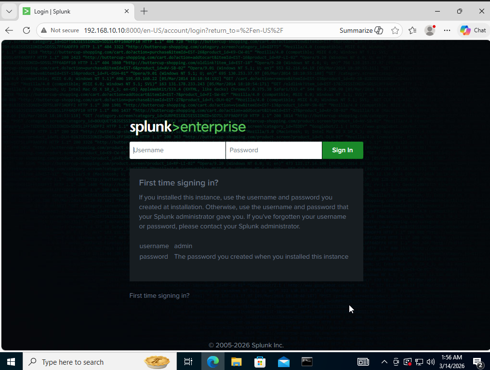
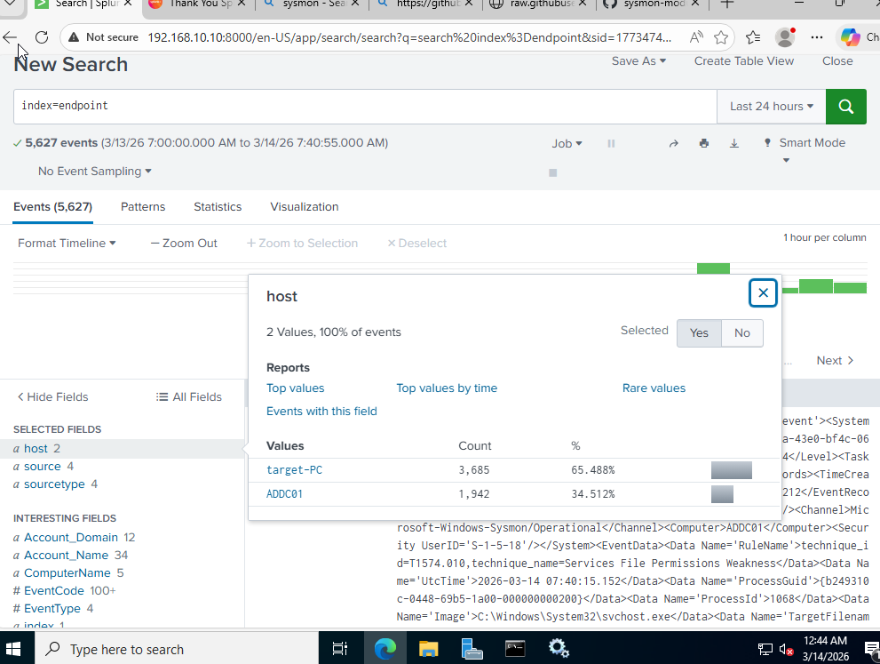
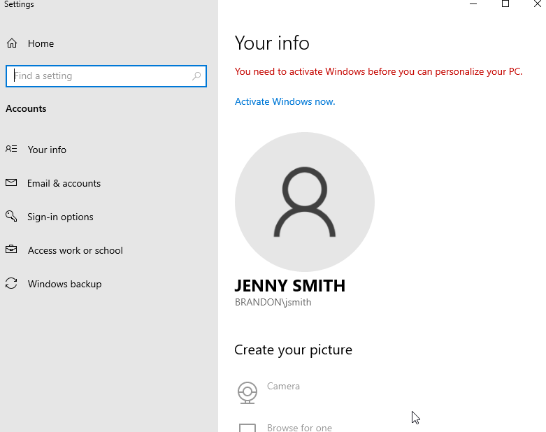

# Active Directory + Splunk Home Lab

## Overview
This project demonstrates the creation of a small enterprise-style security lab used to practice Active Directory administration and centralized log collection using Splunk.

The environment simulates a small domain network where endpoint activity is forwarded to a SIEM for monitoring and analysis.

## Lab Architecture
The environment was built using VirtualBox and includes four virtual machines.

- Windows Server 2022 (Domain Controller)
- Windows 10 Target Machine
- Ubuntu Server (Splunk SIEM)
- Kali Linux (Attacker Machine)

## Virtual Infrastructure
The lab environment was deployed in VirtualBox using multiple systems to simulate an enterprise network.

## Active Directory Setup
The Windows Server was configured as a domain controller for the domain:

`brandon.local`

Administrative tasks included:

- installing Active Directory Domain Services
- creating Organizational Units (IT and HR)
- provisioning domain users
- joining a Windows 10 client to the domain

## Centralized Logging with Splunk
Splunk Enterprise was installed on an Ubuntu server to ingest endpoint telemetry.

Sysmon and Splunk Universal Forwarder were deployed to the Windows systems to forward logs.

The Splunk server successfully received telemetry from multiple hosts.

## Domain Authentication
The Windows client successfully joined the domain and authenticated with a domain user account.

## Skills Demonstrated
- Active Directory administration
- SIEM deployment and log ingestion
- Windows event log monitoring
- Virtualized lab architecture
- Network configuration and troubleshooting
